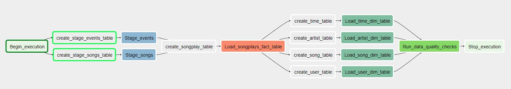

# udacity-nano-degree-5
Udacity Nano Degree Project 5: Data Pipelines with Airflow

### Introduction
A music streaming company, Sparkify, has decided that it is time to introduce more automation and monitoring to their data warehouse ETL pipelines and come to the conclusion that the best tool to achieve this is Apache Airflow.

## Goal
The Sparkify management want to create a high grade data pipelines that is dynamic and built from reusable tasks, can be monitored, and allow easy backfills. They have also noted that the data quality plays a big part when analyses are executed on top the data warehouse and want to run tests against their datasets after the ETL steps have been executed to catch any discrepancies in the datasets.

The source data resides in S3 and needs to be processed in Sparkify's data warehouse in Amazon Redshift. The source datasets consist of JSON logs that tell about user activity in the application and JSON metadata about the songs the users listen to.

## Datasets
The project involves the following two datasets hosted on S3:
1. Log data: s3://udacity-dend/log_data
2. Song data: s3://udacity-dend/song_data

## Project Files Structure


### Song Dataset
The first dataset is a subset of real data from the Million Song Dataset. Each file is in JSON format and contains metadata about a song and the artist of that song. The files are partitioned by the first three letters of each song's track ID. For example, here are filepaths to two files in this dataset.

`
song_data/A/B/C/TRABCEI128F424C983.json
song_data/A/A/B/TRAABJL12903CDCF1A.json
`

And below is an example of what a single song file, TRAABJL12903CDCF1A.json, looks like.
```json
{
  "num_songs": 1,
  "artist_id": "ARJIE2Y1187B994AB7",
  "artist_latitude": null,
  "artist_longitude": null,
  "artist_location": "",
  "artist_name": "Line Renaud",
  "song_id": "SOUPIRU12A6D4FA1E1",
  "title": "Der Kleine Dompfaff",
  "duration": 152.92036,
  "year": 0
}
```

### Log Dataset
The second dataset consists of log files in JSON format generated by this event simulator based on the songs in the dataset above. These simulate activity logs from a music streaming app based on specified configurations.

The log files in the dataset you'll be working with are partitioned by year and month. For example, here are filepaths to two files in this dataset.
`
log_data/2018/11/2018-11-12-events.json
log_data/2018/11/2018-11-13-events.json
`

And below is an example of what a single line of data in a log file, 2018-11-22-events.json, looks like.
```json
{
  "artist": "Dee Dee Bridgewater",
  "auth": "Logged In",
  "firstName": "Lily",
  "gender": "F",
  "itemInSession": 38,
  "lastName": "Koch",
  "length": 318.64118,
  "level": "paid",
  "location": "Chicago-Naperville-Elgin, IL-IN-WI",
  "method": "PUT",
  "page": "NextSong",
  "registration": 1541048010796.0,
  "sessionId": 818,
  "song": "La Vie En Rose",
  "status": 200,
  "ts": 1542845032796,
  "userAgent": "\"Mozilla/5.0 (X11; Linux x86_64) AppleWebKit/537.36 (KHTML, like Gecko) Ubuntu Chromium/36.0.1985.125 Chrome/36.0.1985.125 Safari/537.36\"",
  "userId": "15"
}
```
## Working DAG

